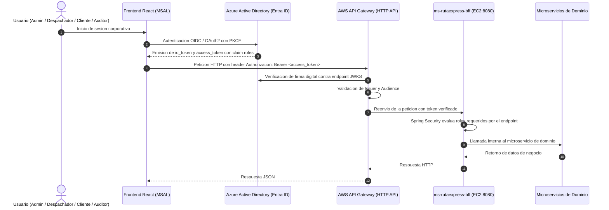

# Guia de Integracion Cloud: Azure Active Directory + AWS API Gateway + AWS EC2

Especificacion tecnica para la integracion de identidad federada corporativa basada en Microsoft Entra ID (Azure AD), AWS API Gateway (HTTP API) y el despliegue del cluster de microservicios en Amazon EC2.

---

## 1. Flujo de Autenticacion y Autorizacion



---

## 2. Configuracion en Azure Active Directory (Microsoft Entra ID)

### 2.1 Registro de la Aplicacion Backend (Resource Server)
1. Iniciar sesion en el portal de administracion de Azure (https://portal.azure.com).
2. Navegar a **Microsoft Entra ID** > **App registrations** > **New registration**.
3. Ingresar:
   - Name: `RutaExpress-Backend-API`
   - Supported account types: *Accounts in this organizational directory only (Single tenant)*
4. Confirmar el registro y registrar los valores asignados:
   - Application (client) ID: `<BACKEND_CLIENT_ID>`
   - Directory (tenant) ID: `<TENANT_ID>`
5. Acceder a la seccion **Expose an API**:
   - En *Application ID URI*, configurar: `api://<BACKEND_CLIENT_ID>`.
   - Agregar un scope llamado `access_as_user` con consentimiento para administradores y usuarios.

### 2.2 Definicion de App Roles
En el menu lateral de `RutaExpress-Backend-API`, acceder a **App roles** y crear los roles del caso:

- **Admin**:
  - Display name: `Admin`
  - Allowed member types: `Users/Groups`
  - Value: `Admin`
  - Description: Administracion de servicios, tarifas, flota y KPIs globales.
- **Despachador**:
  - Display name: `Despachador`
  - Allowed member types: `Users/Groups`
  - Value: `Despachador`
  - Description: Recepcion, preparacion en bodega y marcaje de despacho y entrega.
- **Cliente**:
  - Display name: `Cliente`
  - Allowed member types: `Users/Groups`
  - Value: `Cliente`
  - Description: Creacion y consulta de solicitudes de despacho.
- **Auditor**:
  - Display name: `Auditor`
  - Allowed member types: `Users/Groups`
  - Value: `Auditor`
  - Description: Consulta de trazabilidad y eventos logísticos en modo solo lectura.

### 2.3 Registro de la Aplicacion Frontend (React SPA)
1. Crear un nuevo registro:
   - Name: `RutaExpress-Frontend-React`
   - Redirect URI: Plataforma **SPA**, URI: `http://localhost:5173` (entorno local) o `https://<DOMINIO_PROD>`.
2. En **API permissions** > **Add a permission** > **My APIs**:
   - Seleccionar `RutaExpress-Backend-API`.
   - Marcar el permiso delegado `access_as_user` y otorgar consentimiento de administrador (*Grant admin consent*).

### 2.4 Asignacion de Roles a Usuarios
1. Navegar a **Microsoft Entra ID** > **Enterprise applications** > `RutaExpress-Backend-API`.
2. En la seccion **Users and groups**, asignar a cada usuario corporativo su rol respectivo. El token JWT resultante incluira el claim `"roles": ["Despachador"]`.

---

## 3. Configuracion en AWS API Gateway (HTTP API)

### 3.1 Creacion de la HTTP API
1. En la consola de AWS, acceder a **API Gateway** > **Create API** > **HTTP API** (Build).
2. Especificar el nombre de la API: `rutaexpress-gateway`.
3. Avanzar a la creacion inicial.

### 3.2 Creacion del JWT Authorizer
1. Dentro de la API creada, seleccionar **Authorization** > **Manage authorizers** > **Create**.
2. Configurar los parametros:
   - Authorizer type: `JWT`
   - Name: `AzureAD-Authorizer`
   - Identity source: `$request.header.Authorization`
   - Issuer URL: `https://login.microsoftonline.com/<TENANT_ID>/v2.0`
   - Audience: `api://<BACKEND_CLIENT_ID>`
3. Guardar el autorizador. AWS validara de forma autonoma las claves criptograficas publicas de Microsoft Entra ID.

### 3.3 Integracion con el Servidor EC2
1. En **Integrations** > **Create**:
   - Integration type: `HTTP URI`
   - HTTP method: `ANY`
   - URL: `http://<IP_PUBLICA_EC2_O_DNS>:8080/{proxy}`
2. En **Routes**, crear la ruta comodin:
   - Route: `ANY /{proxy+}`
   - Attach integration: Seleccionar la integracion creada.
   - Authorization: Asignar `AzureAD-Authorizer`.

---

## 4. Despliegue en AWS EC2

### 4.1 Reglas de Firewall (Security Groups)

| Protocolo | Puerto | Origen | Proposito |
|---|---|---|---|
| TCP | 22 | IP_Administrador/32 | Acceso administrativo por SSH |
| TCP | 8080 | 0.0.0.0/0 (o VPC/CIDR de API Gateway) | Trafico de entrada hacia ms-rutaexpress-bff |

Nota de seguridad: Los puertos de los microservicios internos (8081, 8082, 8083) no deben declararse en las reglas de entrada del Security Group; operan exclusivamente dentro de la red privada de Docker.

### 4.2 Script de Instalacion en la Instancia EC2

```bash
# Actualizar repositorios del sistema
sudo dnf update -y || sudo yum update -y

# Instalar Docker Engine
sudo dnf install -y docker || sudo yum install -y docker
sudo systemctl enable --now docker
sudo usermod -aG docker ec2-user

# Instalar Docker Compose v2
sudo mkdir -p /usr/local/lib/docker/cli-plugins
sudo curl -SL https://github.com/docker/compose/releases/latest/download/docker-compose-linux-x86_64 -o /usr/local/lib/docker/cli-plugins/docker-compose
sudo chmod +x /usr/local/lib/docker/cli-plugins/docker-compose

# Aplicar permisos al usuario
newgrp docker
```

### 4.3 Despliegue del Stack

```bash
# Clonar el repositorio
git clone https://github.com/Separd-sudo/rutaexpress-backend.git
cd rutaexpress-backend

# Configurar variables de produccion
export SECURITY_AZURE_ENABLED=true
export AZURE_JWT_ISSUER_URI=https://login.microsoftonline.com/<TENANT_ID>/v2.0
export AZURE_JWK_SET_URI=https://login.microsoftonline.com/<TENANT_ID>/discovery/v2.0/keys

# Iniciar los servicios
docker compose up -d --build
```

---

## 5. Integracion con React (MSAL)

Configuracion en `src/authConfig.js`:

```javascript
export const msalConfig = {
  auth: {
    clientId: "<FRONTEND_CLIENT_ID>",
    authority: "https://login.microsoftonline.com/<TENANT_ID>",
    redirectUri: "http://localhost:5173"
  },
  cache: {
    cacheLocation: "sessionStorage",
    storeAuthStateInCookie: false
  }
};

export const loginRequest = {
  scopes: ["api://<BACKEND_CLIENT_ID>/access_as_user"]
};
```

Interceptor de cliente HTTP (Axios) para inyectar el Bearer token:

```javascript
import axios from "axios";
import { PublicClientApplication } from "@azure/msal-browser";
import { msalConfig, loginRequest } from "./authConfig";

const msalInstance = new PublicClientApplication(msalConfig);

const apiClient = axios.create({
  baseURL: "https://<API_GATEWAY_ID>.execute-api.<REGION>.amazonaws.com"
});

apiClient.interceptors.request.use(async (config) => {
  const accounts = msalInstance.getAllAccounts();
  if (accounts.length > 0) {
    const tokenResponse = await msalInstance.acquireTokenSilent({
      ...loginRequest,
      account: accounts[0]
    });
    config.headers.Authorization = `Bearer ${tokenResponse.accessToken}`;
  }
  return config;
});

export default apiClient;
```