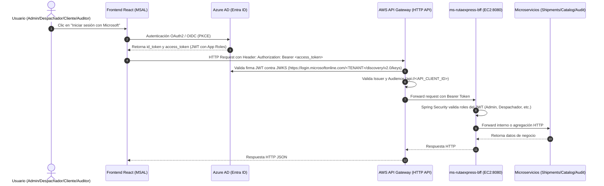

# Guía de Integración Cloud: Azure AD (Entra ID) + AWS API Gateway + AWS EC2

Esta guía técnica explica paso a paso cómo integrar la identidad corporativa de **Microsoft Azure AD (Entra ID)** con **AWS API Gateway**, el despliegue en **AWS EC2** y los microservicios backend de **RutaExpress**.

---

## Arquitectura de Seguridad y Flujo de Autenticación



---

## 1. Configuración en Azure Active Directory (Microsoft Entra ID)

### Paso 1.1: Registrar la Aplicación Backend (Resource Server)
1. Inicia sesión en el portal de Azure: [https://portal.azure.com](https://portal.azure.com).
2. Ve a **Microsoft Entra ID** > **App registrations** (Registros de aplicaciones) > **New registration** (Nuevo registro).
3. Configura:
   - **Name**: `RutaExpress-Backend-API`
   - **Supported account types**: *Accounts in this organizational directory only (Single tenant)*
   - Clic en **Register**.
4. Anota los siguientes valores de la pantalla de visión general:
   - **Application (client) ID**: `<BACKEND_CLIENT_ID>`
   - **Directory (tenant) ID**: `<TENANT_ID>`
5. Ve a **Expose an API** (Exponer una API):
   - Clic en **Set** en *Application ID URI*.
   - Configura: `api://<BACKEND_CLIENT_ID>`.
   - Clic en **Add a scope**:
     - Scope name: `access_as_user`
     - Who can consent: *Admins and users*
     - Admin consent display name: *Acceso a APIs de RutaExpress*
     - State: *Enabled*.

### Paso 1.2: Definir los Roles de la Aplicación (App Roles)
En el menú lateral de la app `RutaExpress-Backend-API`:
1. Ve a **App roles** > **Create app role**.
2. Crea los 4 roles especificados en el caso:
   - **Rol 1 (Admin)**:
     - Display name: `Admin`
     - Allowed member types: `Users/Groups`
     - Value: `Admin`
     - Description: *Administra servicios, capacidad y visualiza KPIs de la red.*
   - **Rol 2 (Despachador)**:
     - Display name: `Despachador`
     - Allowed member types: `Users/Groups`
     - Value: `Despachador`
     - Description: *Acepta envíos, gestiona rutas y marca entregas.*
   - **Rol 3 (Cliente)**:
     - Display name: `Cliente`
     - Allowed member types: `Users/Groups`
     - Value: `Cliente`
     - Description: *Crea envíos y realiza el seguimiento de su carga.*
   - **Rol 4 (Auditor)**:
     - Display name: `Auditor`
     - Allowed member types: `Users/Groups`
     - Value: `Auditor`
     - Description: *Consulta el timeline de eventos de trazabilidad. Solo lectura.*

### Paso 1.3: Registrar la Aplicación Frontend (React SPA)
1. Ve a **App registrations** > **New registration**.
2. Configura:
   - **Name**: `RutaExpress-Frontend-React`
   - **Supported account types**: *Single tenant*
   - **Redirect URI**: Plataforma **SPA (Single-page application)**, URI: `http://localhost:5173` (desarrollo) y `https://<TU_DOMINIO_PROD>` (producción).
3. Clic en **API permissions** > **Add a permission**:
   - Selecciona **My APIs** > Elige `RutaExpress-Backend-API`.
   - Selecciona **Delegated permissions** > Marca `access_as_user`.
   - Clic en **Grant admin consent for <TU_ORGANIZACION>**.

### Paso 1.4: Asignar Roles a los Usuarios
1. Ve a **Microsoft Entra ID** > **Enterprise applications** (Aplicaciones empresariales).
2. Busca y selecciona `RutaExpress-Backend-API`.
3. Ve a **Users and groups** > **Add user/group**:
   - Selecciona los usuarios de prueba y asígnales el rol respectivo (`Admin`, `Despachador`, `Cliente` o `Auditor`).
   *Nota: Cuando este usuario inicie sesión, Azure AD incluirá en el JWT el claim `"roles": ["Despachador"]`.*

---

## 2. Configuración en AWS API Gateway (HTTP API)

Utilizaremos **HTTP API** de AWS API Gateway debido a su soporte nativo para **JWT Authorizers** de alto rendimiento y bajo costo.

### Paso 2.1: Crear el HTTP API
1. En la consola de AWS, busca **API Gateway**.
2. Clic en **Create API** > En la tarjeta **HTTP API**, clic en **Build**.
3. **API details**:
   - API Name: `rutaexpress-gateway`
4. Clic en **Next**, luego en **Next** (dejar rutas para el siguiente paso) y en **Create**.

### Paso 2.2: Crear el JWT Authorizer
1. En el menú lateral izquierdo de tu API, haz clic en **Authorization** (Bajo *Develop*).
2. Haz clic en la pestaña **Manage authorizers** > **Create**.
3. Configura los parámetros:
   - **Authorizer type**: `JWT`
   - **Name**: `AzureAD-EntraID-Authorizer`
   - **Identity source**: `$request.header.Authorization`
   - **Issuer URL**:
     ```text
     https://login.microsoftonline.com/<TENANT_ID>/v2.0
     ```
   - **Audience**:
     ```text
     api://<BACKEND_CLIENT_ID>
     ```
4. Clic en **Create**.
   *AWS validará automáticamente la firma criptográfica de cada request consultando las claves públicas de Microsoft Entra ID (`/.well-known/openid-configuration` y JWKS).*

### Paso 2.3: Configurar la Integración hacia el BFF en EC2
1. En el menú lateral, ve a **Integrations** > **Create**.
2. **Integration type**: `HTTP URI`
3. **Integration details**:
   - HTTP method: `ANY`
   - URL: `http://<EC2_PUBLIC_IP_OR_DNS>:8080/{proxy}`
4. Clic en **Create**.

### Paso 2.4: Configurar Rutas y Proteger con el Authorizer
1. En el menú lateral, ve a **Routes** > **Create**.
2. Configura:
   - Route: `ANY /{proxy+}`
   - Integration: Selecciona la integración HTTP creada hacia el BFF.
   - Authorization: Selecciona `AzureAD-EntraID-Authorizer`.
3. Para endpoints de healthcheck público (opcional):
   - Crear ruta: `GET /api/bff/health` con Authorization: `None`.

---

## 3. Despliegue del Backend en AWS EC2

### Paso 3.1: Configuración de Security Groups en AWS
En la consola de Amazon EC2, crea un **Security Group** con las siguientes reglas de entrada (Inbound Rules):

| Tipo | Puerto | Protocolo | Origen | Propósito |
|---|---|---|---|---|
| SSH | 22 | TCP | `Tu_IP_Administrador/32` | Acceso seguro a la consola del servidor |
| Custom TCP | 8080 | TCP | `0.0.0.0/0` (o IP/VPC de API Gateway) | Tráfico público/gateway hacia `ms-rutaexpress-bff` |

> [!IMPORTANT]
> Los puertos de los microservicios internos (`8081` para shipments, `8082` para catalog, `8083` para audit) **NUNCA deben exponerse públicamente en el Security Group**. La comunicación entre ellos se realiza a través de la red interna Docker (`rutaexpress-net`).

### Paso 3.2: Instalación de Docker y Docker Compose en la Instancia EC2
Conéctate por SSH a tu instancia EC2:
```bash
ssh -i "tu-llave.pem" ec2-user@<EC2_PUBLIC_IP>
```

Ejecuta los siguientes comandos para preparar el entorno:
```bash
# Actualizar el sistema
sudo dnf update -y || sudo yum update -y

# Instalar Docker
sudo dnf install -y docker || sudo yum install -y docker
sudo systemctl enable --now docker
sudo usermod -aG docker $USER

# Instalar Docker Compose (v2)
sudo mkdir -p /usr/local/lib/docker/cli-plugins
sudo curl -SL https://github.com/docker/compose/releases/latest/download/docker-compose-linux-x86_64 -o /usr/local/lib/docker/cli-plugins/docker-compose
sudo chmod +x /usr/local/lib/docker/cli-plugins/docker-compose

# Aplicar permisos al usuario actual
newgrp docker
```

### Paso 3.3: Clonar el Repositorio y Desplegar
```bash
# Clonar el proyecto
git clone https://github.com/separd-sudo/<NOMBRE_REPO>.git
cd <NOMBRE_REPO>

# Configurar variables para validar JWT en producción (opcional)
export SECURITY_AZURE_ENABLED=true
export AZURE_JWT_ISSUER_URI=https://login.microsoftonline.com/<TENANT_ID>/v2.0
export AZURE_JWK_SET_URI=https://login.microsoftonline.com/<TENANT_ID>/discovery/v2.0/keys

# Levantar el stack completo de microservicios
docker compose up -d --build

# Verificar el estado de los contenedores
docker compose ps
```

---

## 4. Conexión desde el Frontend React (MSAL React)

Para consumir la plataforma desde React, instala las dependencias oficiales:
```bash
npm install @azure/msal-browser @azure/msal-react axios
```

### Configuración de MSAL (`src/authConfig.js`):
```javascript
export const msalConfig = {
  auth: {
    clientId: "<FRONTEND_CLIENT_ID>",
    authority: "https://login.microsoftonline.com/<TENANT_ID>",
    redirectUri: "http://localhost:5173",
  },
  cache: {
    cacheLocation: "sessionStorage",
    storeAuthStateInCookie: false,
  }
};

export const loginRequest = {
  scopes: ["api://<BACKEND_CLIENT_ID>/access_as_user"]
};
```

### Interceptor Axios para invocar el API Gateway:
```javascript
import axios from "axios";
import { PublicClientApplication } from "@azure/msal-browser";
import { msalConfig, loginRequest } from "./authConfig";

const msalInstance = new PublicClientApplication(msalConfig);

const apiClient = axios.create({
  baseURL: "https://<TU_API_GATEWAY_ID>.execute-api.<REGION>.amazonaws.com"
});

apiClient.interceptors.request.use(async (config) => {
  const accounts = msalInstance.getAllAccounts();
  if (accounts.length > 0) {
    const response = await msalInstance.acquireTokenSilent({
      ...loginRequest,
      account: accounts[0]
    });
    config.headers.Authorization = `Bearer ${response.accessToken}`;
  }
  return config;
});

export default apiClient;
```

---

## 5. Matriz de Verificación y Pruebas de Seguridad

| Escenario | Rol Usuario | Endpoint Invocado | Resultado Esperado |
|---|---|---|---|
| Crear servicio de catálogo | `Cliente` | `POST /api/bff/catalog/services` | **HTTP 403 Forbidden** (Solo Admin) |
| Crear servicio de catálogo | `Admin` | `POST /api/bff/catalog/services` | **HTTP 201 Created** |
| Actualizar estado de envío | `Despachador` | `PUT /api/bff/shipments/1/status` | **HTTP 200 OK** |
| Consultar auditoría | `Auditor` | `GET /api/bff/audit` | **HTTP 200 OK** |
| Petición sin token Bearer | Anónimo | `POST /api/bff/shipments` | **HTTP 401 Unauthorized** (API Gateway / BFF) |